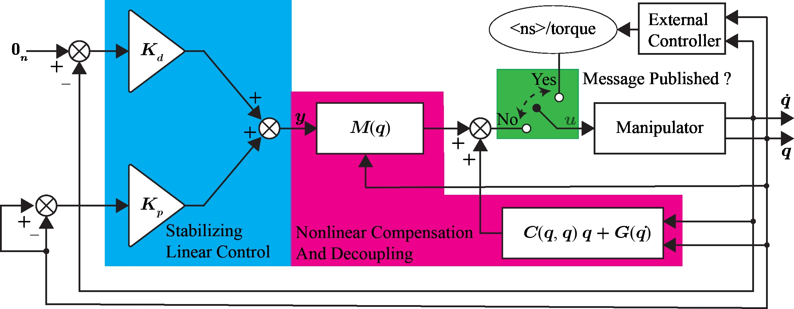

# Torque Controllers

This package is made for the torque controllers for robotic manipulators. For inutition behind the source code, please visit https://shravista.github.io/blog/torque-controllers-for-manipulators.html

Switching-base Control Architeture



## Steps for installation
Requirements: Ubuntu 24.04, ROS 2 Jazzy Jalisco, pinocchio, ros2 controllers, gazebo harmonic.

These steps assumes that ros2_control, ros2_controllers, gazebo sim (harmonic), gz_ros2_control are already installed. In addition one needs
```
sudo apt install ros-jazzy-pinocchio
```

#### Note: Compilation with pinocchio takes significant build time. But the runtime execution is pretty fast.

Preparation:
1. Clone Git Repo
```
git clone https://github.com/Shravista/torque_controllers.git
```
2. compile packages
```
colcon build --symlink-install --cmake-args -DCMAKE_EXPORT_COMPILE_COMMANDS=ON
```

## Testing the repo

1. launch file -> bring robot simulation
```
ros2 launch example_robots iiwa14_bringup_launch.py
```
2. example tests

2.1. Set Point Tracking

```
ros2 run torque_control_tests iDControlVer2 0 --ros-args --params-file  <WORKSPACE>/torque_controllers/torque_control_tests/config/inverseDynamicsControl.yaml
```

2.2 Trajectory tracking

```
ros2 run torque_control_tests iDControlVer2 0 --ros-args --params-file  <WORKSPACE>/torque_controllers/torque_control_tests/config/inverseDynamicsControl.yaml
```

For more details on changing the set Point and tracking trajectory, readers are referred to the files `torque_control_tests/src/iDControlVer2.cpp` and `torque_control_tests/src/inverseDynamicsControl.cpp`

## Warning
Since the convergence of the velocity states are asymptotic in nature, one can observe the drift in position very slowly. However, the convergence rate on the velocity state can be increased through increasing gains.

### To Do List
1. integration with real robots

